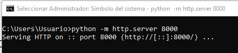

## Servidor Web con Simple Web Server en Python

Para crear el servidor web tenemos que escribir en la consola el siguiente comando, para que se genere la página web que queramos tenemos que ejecutar el comando en la ruta en la que tengamos nuestro index.html

Aquí podemos ver como python nos sirve el puerto 8000 para poder abrir nuestro servidor

Si accedemos al servidor desde el navegador usando el comando localhost:8000 podemos visualizar el contenido de nuestro index.html
