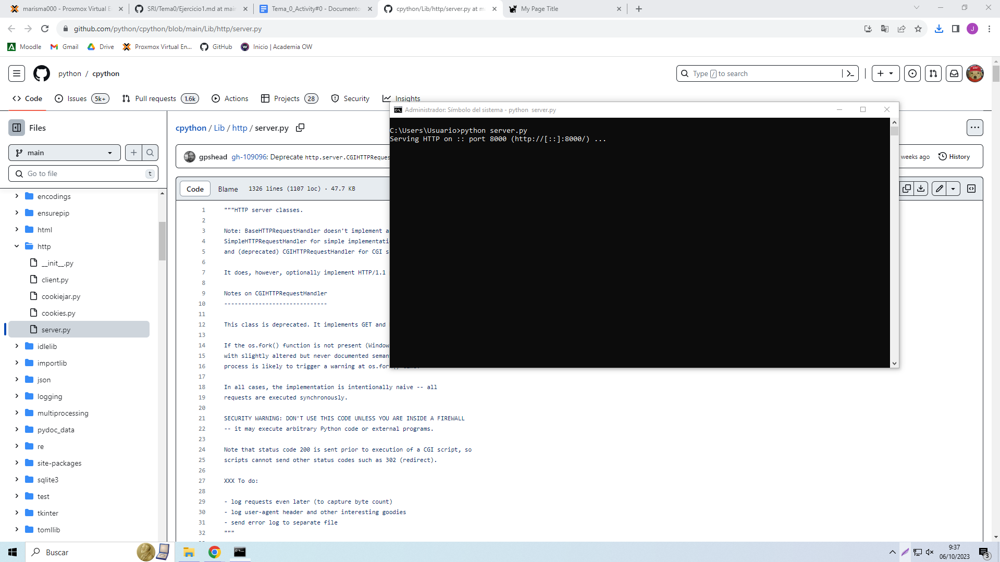
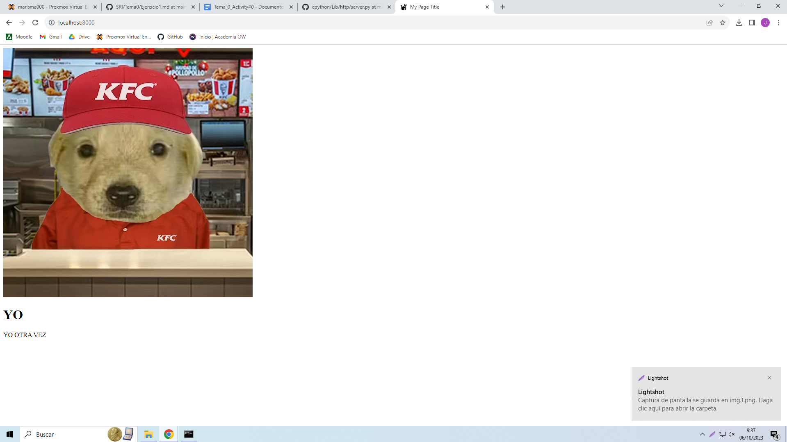

## Servidor Web con Http Server

Descargamos el fichero que contiene el servidor y lo movemos a la carpeta en la que tengamos nuestro index.html
Ejecutamos el archivo server.py en la ruta en la que tenemos nuestro fichero index

Podemos visualizar el contenido del index si entramos en google y entramos en localhost en el puerto 8000

