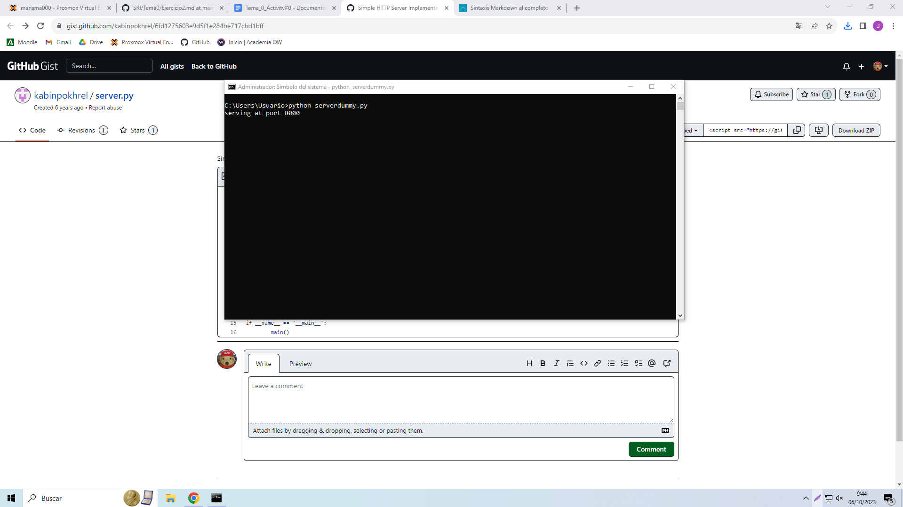

## Servidor Web con Dummy Web Server

Para crear un servidor con dummy, descargamos el fichero de github y lo movemos a la ruta en la cual tengamos nuestro fichero index.html

Lo ejecutamos desde la consola escribiendo python serverdummy.py

Como podemos ver el servidor está ejecutandose en el puerto 8000

Si entramos en el navegador en la dirección localhost:8000 podemos visualizar el contenido de nuestro fichero index.html
